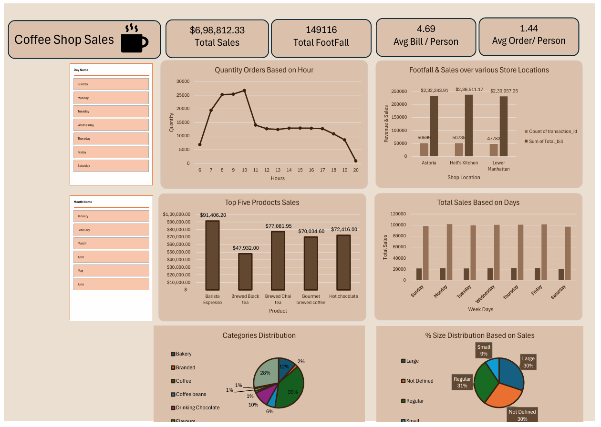

# ☕ Coffee Shop Sales Analysis

## 📊 Data Analytics Project

An Excel-based Data Analytics project focused on analyzing coffee shop sales, customer footfall, product performance, store performance, and sales trends.

The project uses **Microsoft Excel, Pivot Tables, Calculated Measures, Charts, KPIs, and Slicers** to transform transaction data into an interactive business dashboard.

---

## 👨‍💻 Developed By

**Het Patel**

---

## 🎯 Project Objective

The main objective of this project is to analyze coffee shop transaction data and identify useful business insights related to:

- Sales performance
- Customer footfall
- Product performance
- Category performance
- Store/location performance
- Order size
- Hourly demand
- Daily sales
- Monthly sales trends

The analysis helps understand **when customers purchase, what products generate the most sales, and how different stores and categories perform.**

---

## 🛠️ Tools & Technologies

- **Microsoft Excel**
- **Pivot Tables**
- **Calculated Measures / Fields**
- **KPIs**
- **Charts & Visualizations**
- **Slicers**
- **Data Analysis**
- **Dashboard Development**

---

## 📌 Key Performance Indicators (KPIs)

The dashboard contains important business KPIs:

| KPI | Value |
|---|---:|
| 💰 Total Sales | $698,812.33 |
| 👥 Total Footfall | 149,116 |
| 🧾 Average Bill / Person | 4.69 |
| 📦 Average Order / Person | 1.44 |

---

## 🔍 Analysis Performed

### 1. ⏰ Hourly Order Analysis

Analyzed order quantity by hour to identify customer demand throughout the day.

The analysis covers:

**6:00 AM – 8:00 PM**

The highest displayed order quantity occurs around:

**10:00 AM — 26,713 orders**

This analysis can help understand peak operating hours.

---

### 2. 📅 Day-wise Sales Analysis

Analyzed total sales for each day of the week:

- Sunday
- Monday
- Tuesday
- Wednesday
- Thursday
- Friday
- Saturday

This helps identify differences in sales activity across weekdays.

---

### 3. 📈 Monthly Sales Analysis

Analyzed sales from:

- January
- February
- March
- April
- May
- June

The analysis shows the sales trend across the six-month period.

**Highest displayed month: June — $166,485.88**

---

### 4. ☕ Product Analysis

Analyzed the products generating the highest sales.

The dashboard highlights the following top products:

1. Barista Espresso
2. Brewed Chai Tea
3. Hot Chocolate
4. Gourmet Brewed Coffee
5. Brewed Black Tea

**Top displayed product: Barista Espresso — $91,406.20**

---

### 5. 🏷️ Category Analysis

Analyzed sales performance across different product categories:

- Coffee
- Tea
- Bakery
- Drinking Chocolate
- Coffee Beans
- Branded
- Loose Tea
- Flavours
- Packaged Chocolate

The two largest displayed categories are:

**Coffee — $269,952.45**

**Tea — $196,405.95**

---

### 6. 🏪 Store Location Analysis

Analyzed sales and transaction counts across different store locations:

- Astoria
- Hell's Kitchen
- Lower Manhattan

The analysis compares:

- Total transactions
- Total sales
- Store performance

---

### 7. 📦 Order Size Analysis

Analyzed sales based on order size:

- Large
- Regular
- Small
- Not Defined

This helps understand the distribution of different order sizes.

The dashboard also shows a significant **Not Defined** category, which can be considered a data-quality point for further investigation.

---

## 📊 Dashboard

The project includes an interactive Excel dashboard containing:

- KPI cards
- Sales charts
- Product analysis
- Category analysis
- Store analysis
- Time-based analysis
- Slicers
- Interactive filters

Users can interact with the dashboard to explore different periods and sales dimensions.

---

## 📷 Dashboard Preview



---

## 📋 Project Structure

```text
Coffee-Shop-Sales-Analysis/
│
├── Coffee_Shop_Sales_Analysis.xlsx
│
├── Coffee_Shop_Analysis_Report.pdf
│
├──  dashboard.png
│    
│
└── README.md
